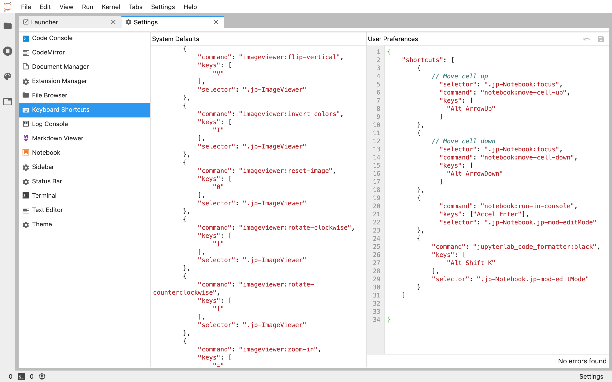
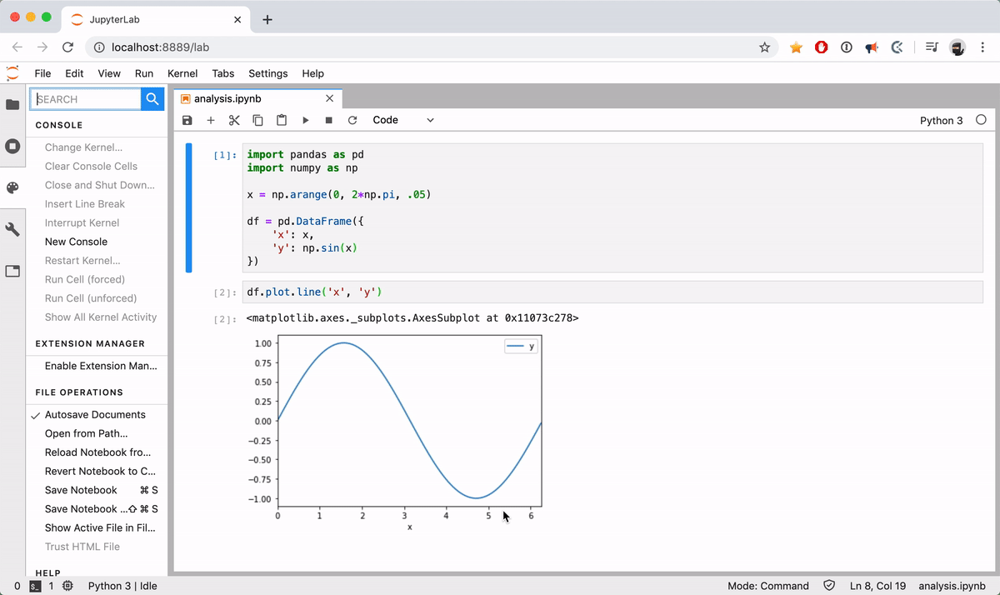

Jupyter Studio
==============

Notes on my jupyter lab setup for data analysis.

Table of Contents
-----------------

- [Keyboard Shortcuts](#keyboard-shortcuts)
- [Extensions](#extensions)
- [Customizing](#customizing)
- [Setup Instructions](#setup-instructions)

Keyboard Shortcuts
------------------

| command | outcome | demo |
| ------- | ------- | ---- |
| `CMD + ,` | open shortcuts menu |  |
| `CMD + B` | toggle sidebar |  |

Extensions
----------

```shell
# Handy table of contents
jupyter labextension install @jupyterlab/toc

# Black formatter
jupyter labextension install @ryantam626/jupyterlab_code_formatter
python3 -m pip install jupyterlab_code_formatter
jupyter serverextension enable --py jupyterlab_code_formatter --sys-prefix

# Jump to where a variable is defined
jupyter labextension install @krassowski/jupyterlab_go_to_definition

# Easy file opening
pip install jupyterlab-quickopen
jupyter labextension install @parente/jupyterlab-quickopen

# Variable inspector
jupyter labextension install @lckr/jupyterlab_variableinspector

# Git in jupyter lab
jupyter labextension install @jupyterlab/git
pip install --upgrade jupyterlab-git

# qgrid
pip install qgrid
jupyter nbextension enable --py --sys-prefix qgrid
jupyter labextension install qgrid

```

### jupyterlab-toc

Customizing
-----------

### Where do my settings come from?

```
jupyter --path
```

```shell
config:
    /Users/machow/.jupyter
    /Users/machow/.pyenv/versions/3.6.8/etc/jupyter
    /usr/local/etc/jupyter
    /etc/jupyter
```

### How do I specify where settings should come from?

```
export JUPYTER_CONFIG_DIR=some/path/to/.jupyter
```

### How do I export my shortcuts?

```
# run jupyter --path to find the right directory, then..
cat /Users/machow/.jupyter/lab/user-settings/\@jupyterlab/shortcuts-extension/shortcuts.jupyterlab-settings
```


Setup Instructions
------------------

Contributing
------------

Tools used for 

* Screencasts - Kap: https://github.com/wulkano/kap
* Keystroke Viz - KeyCastr: https://github.com/keycastr/keycastr

Screencasts are saved to `images` folder, using the format `{category}-{name}-{resolution}.gif`.
